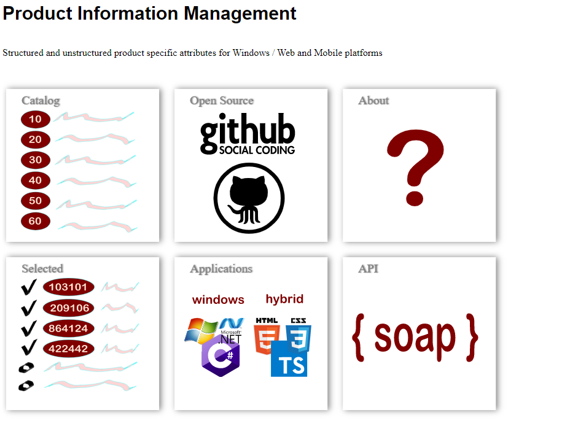
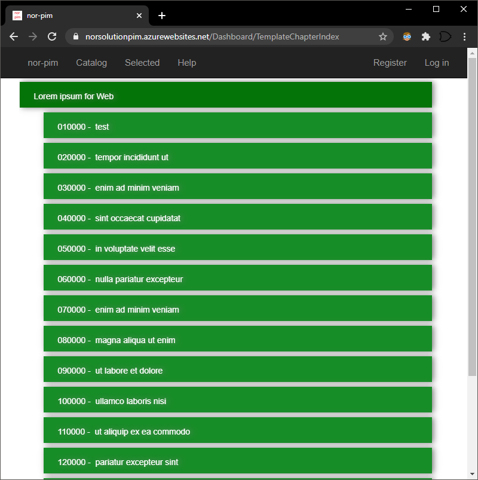
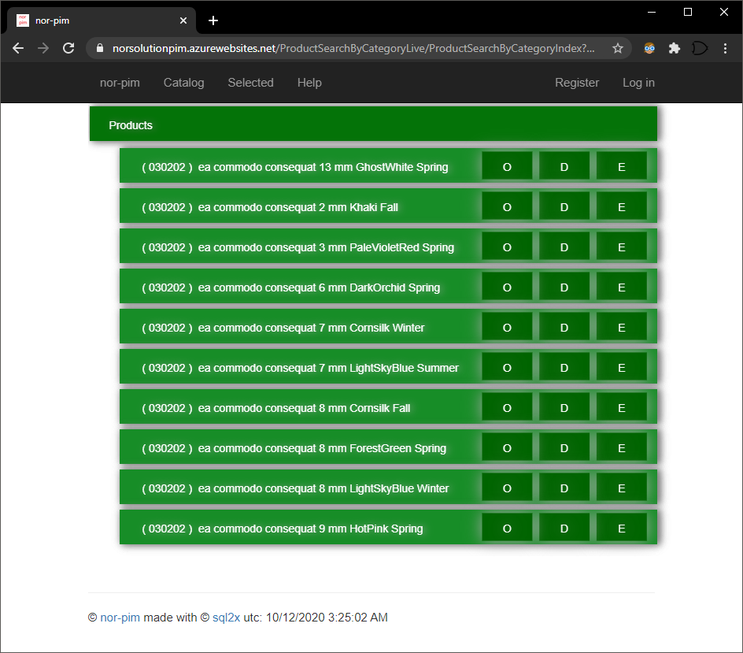
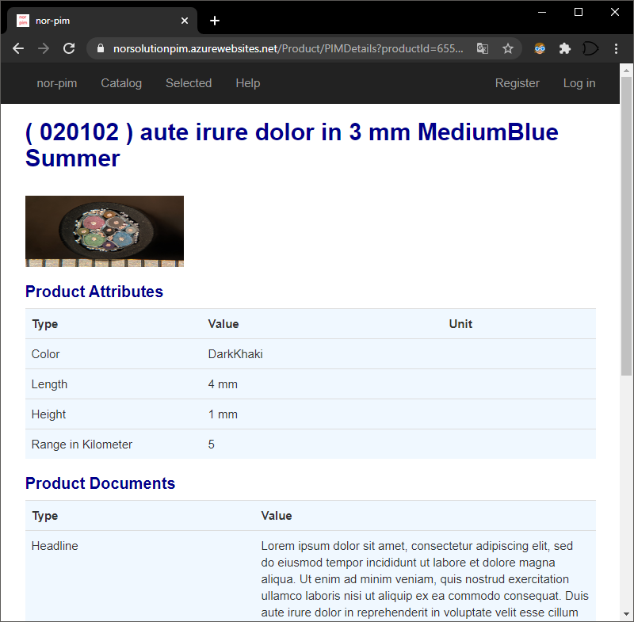
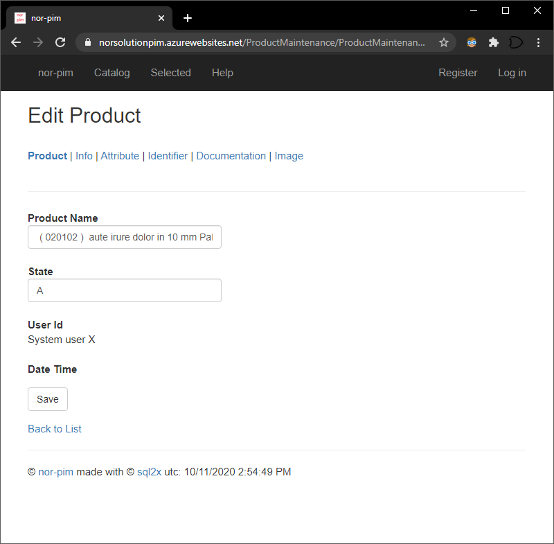
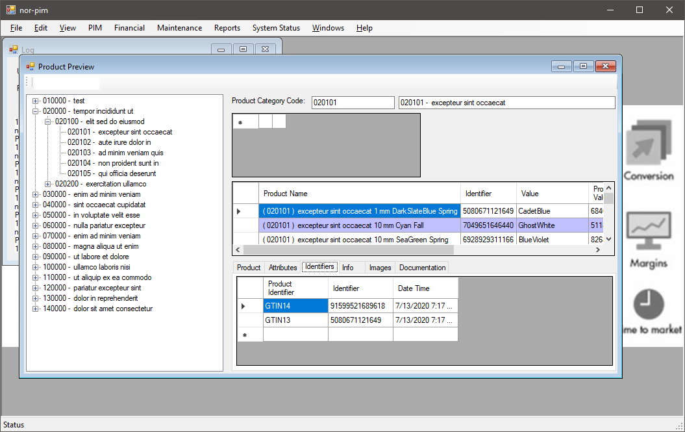
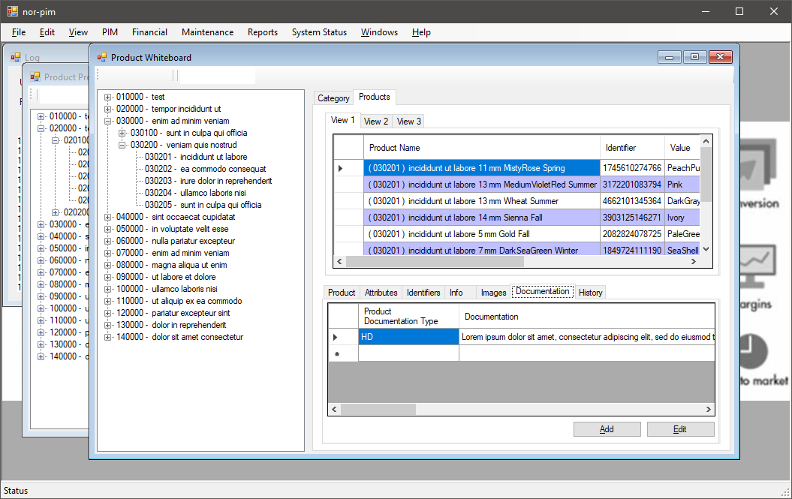
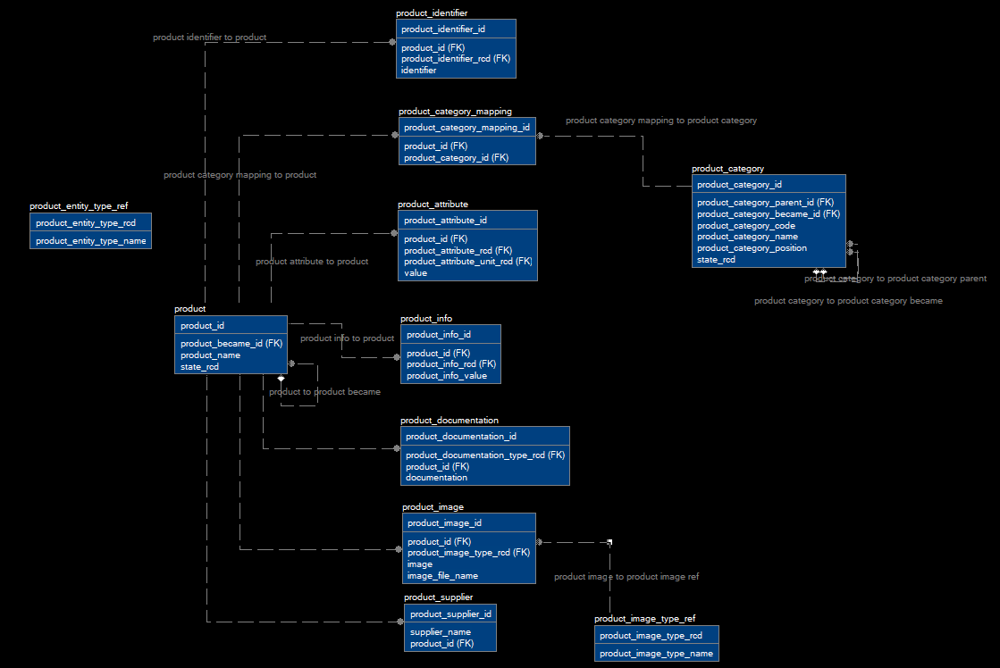

# NorPim - Open Source

## Todo
 - Applications Tile needs a better Windows install page
 - What about the *Web* version, how do i distinguish it from the Hybrid
 - Format all code
 - DashboardInfo frame
 - WinForm, paste from Excel

NorPim is a Product Information Management System written for enterprise cloud environments with user interfaces tailored for PC, Web and Mobile. It is centered around Microsoft products like SQL Server, Azure, Visual Studio, C# and TypeScript.

The code is written by one developer over the course of several years, where focus has been on *simple*, *clean* and *maintainable* code. 

**90%** of the code is produced by a Code Generator [sql2x](www.sql2x.org). The general idea is to use as few Frameworks and dependencies as possible in order to make a product that will stand the test of time without having to be rewritten when technology shifts happens and Frameworks and Dependencies become incompatible.

The last **10%** of the code mainly consists of user interface tweaks to support new User Interface trends and fads, business layer code to interact with other systems, import/export, etc.

The example Catalog and Product data is all Latin "Lorem ipsum" Gibberish, this to take focus away from the data as any Product related data can be handled by NorPim.

The goal of Open Sourcing NorPim is to attract organizations/developers to make more tailored User Interfaces tailored towards more specialized businesses while keeping the core sturdy enough to handle both large and huge amount of products as fast as possible on the infrastructure it runs on. 

Currently NorPim runs with SQL Server, but there are only Tables, Columns and Relations.. no Stored Procedures or Functions is used, making NorPim easily adaptable for other databases on other platforms like Linux. Same with the business layer, dotNetCore under Linux is most definitely in the pipeline. The business logic in the **10%** manual code in NorPim is not expected to change at all during this transition.

Live [NorPim running under Azure](http://www.NorPim.com) In this configuration all 3 FrontEnds runs under one Azure App, the WCF/SOAP layer in another one and finally Azure SQL Database on a third server.

## Visual Studio 2017
NorPim requires Visual Studio 2017 which can be downloaded [here](https://visualstudio.microsoft.com/vs/older-downloads/)

## Code
 - [GitHub](https://github.com/aunebakk/nor-pim)
   - **GitHub CLI**: gh repo clone aunebakk/nor-pim
   - **Git**: git clone https://github.com/aunebakk/nor-pim.git
   - Compressed [zip](https://github.com/aunebakk/nor-pim/archive/master.zip) file

## How to run code on local computer
Use PowerShell to reinsert passwords and secrets:

 - De-Sanitize Connection

| Parameter                             | Comment                                           |
|---------------------------------------|---------------------------------------------------|
| connectionStringSQLServerLocal        | ADO connection string to a SQL Server

**From PowerShell**

 & '.\Operational\De-Sanitize Connection.ps1' -connectionStringSQLServerLocal:"Data Source=(localdb)\MSSQLLocalDB;Integrated Security=True;Connect Timeout=30;Encrypt=False;TrustServerCertificate=True;ApplicationIntent=ReadWrite;MultiSubnetFailover=False;Initial Catalog=NorSolutionPim;"
 
 **From Visual Studio 2017**

 - Clean build
 - Run DatabaseManager to create the Database and populate it's tables
 - Start Business, confirm WCF/SOAP 
 - Select Business and Web as startup
 - Run

## How to publish to azure

| Parameter                             | Comment                                           |
|---------------------------------------|---------------------------------------------------|
| connectionStringSQLServerLocal        | ADO connection string to a SQL Server
| emailPersonalSecond                   | Azure Active Directory Login eMail
| passwordPersonalStyleLargeEndingTwo   | Azure Active Directory Login password

**From PowerShell**

& '.\Operational\De-Sanitize Connection.ps1' `
  -connectionStringSQLServerLocal:"Data Source=hri0nhlzkl.database.windows.net;Persist Security Info=True;User ID=norgate;Password=njas42379HGI;Pooling=False;MultipleActiveResultSets=False;Encrypt=True;TrustServerCertificate=False;Connection Timeout=120;Initial Catalog=NorSolutionPim;" `
  -emailPersonalSecond:'roger@aunebakk.com' `
  -passwordPersonalStyleLargeEndingTwo:'en8to3FIRE2'
 
 **The Web and Window Front**
 - NuGet.exe restore .\SolutionNorSolutionPim.sln ( Download NuGet here: https://docs.microsoft.com/en-us/nuget/release-notes/nuget-4.9-rtm )
 - & '.\Operational\Restore packages.bat'
 - & '.\WinForm\Operational\Publish WinForm layer to ASP site install directory.bat'
 - & '.\Web\Operational\Get-Web-App-PublishingProfile.ps1'
 - & '.\Web\Operational\Build package to disk.bat'
 - & '.\Web\Operational\Publish To Azure.bat'

At this point the Front can only be used to bring up the start page and the about box.

**The Business Layer**
 - & '.\Business\Operational\Get-Web-App-PublishingProfile.ps1'
 - & '.\Business\Operational\Build package to disk.bat'
 - & '.\Business\Operational\Publish To Azure.bat'

**The Database**

The web front is responsible for creating and updating the database, so the Front needs to be published before the database can be created. 

 - https://norsolutionpim.azurewebsites.net/database
   - Database Management Create Database
   - Database Management Set Version Zero	Database
   - Database Management Increase Version To Latest step by step
   - Database Management Version Object ( Should be 0.14.0 )

**Open URL to published Hybrid/Web front, you will find the starting point for the Windows version under Applications Tile**

## This ReadMe
Is an top-down view of NorPim, starting with all user visible aspects, going through the Architecture from client proxies to business layer and the database.

## The Repository

This repository ("`NorPim`") is where we ( NorGate ) develop the [NorPim](http://NorPim.com) product. Not only do we work on code and issues here, we also publish our [roadmap](https://github.com/aunebakk/nor-pim/wiki/Roadmap), [monthly iteration plans](https://github.com/aunebakk/nor-pim/wiki/Iteration-Plans), and our [endgame plans](https://github.com/aunebakk/nor-pim/wiki/Running-the-Endgame). This source code is available to everyone under the standard [MIT license](https://github.com/aunebakk/nor-pim/blob/master/LICENSE.txt).

## DashBoard
This is the starting page for the Hybrid Mobile/Web side of NorPim. It supports portrait and landscape mode, so rotating a mobile device will change layout of tiles.

  

## Hybrid/Web Catalog Index view
This view is used for navigating the index of your products. It supports portrait and landscape mode, so rotating a mobile device will change layout of tiles. This view is the first level, clicking a tile will bring the user to level 2, then level 3 and finally to the product view.

  

## Hybrid/Web Product view
This is the product selection view, it allows for "Ordering/Selecting" a product, get Details about a product or Edit a product.

  

## Hybrid/Web Detail view
The detail page allows the user to see all essential information about a product in a Web page.

  

## Hybrid/Web Edit page
The edit page allows the user to edit all essential information about a product in a Web page.

The user will have to Login in order to save any changes ( TODO )

  

## Windows Product Preview
The windows version features it's own installation and has access to everything NorPim has to offer. 

  

## Windows Whiteboard
For editing all Product data, including an all inclusive history of all changes done to the product. Support for Excel Cut and Paste is in place.

  

[NorPim](https://NorPim.com) is a distribution of the `NorPim` repository with NorGate specific customizations released under a traditional [NorGate product license](https://NorPim.com/License/).

[NorPim](https://NorPim.com) Product Information Management - Structured and unstructured product specific attributes for Windows / Web and Mobile platform.

NorPim is a Product Information Management System written for enterprise cloud environments with user interfaces tailored for PC, Web and Mobile.

NorPim is used for managing Structured and Unstructured product specific attributes which is either maintained manually or automatically.

NorPim provides full access to a Product and it's structure with a fixed or customized API through WCF/SOAP interfaces.

NorPim is still in a prototype stage, and it's main purpose is to act as a proof of concept for a three tiered cloud based "Line of Business" system that features:

 - SQL Server database
 - Business layer through WCF/SOAP / ASP
 - FrontEnd's consuming the WCF/SOAP layer :
   - Windows application ( Full Maintenance Capabilities )
   - Web Site ( Browsing and editing products / Product bucket )
   - Mobile Hybrid App ( Browsing and editing products / Product bucket )

NorPim uses no special frameworks outside of the dotNetFramework ecosystem in an effort to make it as scalable and maintainable as possible, this is made possible by using a tool to generate boiler plate code for efficient communication between layers ( SQL2X ). Since the code is bare bone C# and TypeScript it is also easy to find developers to maintain the code.

## Languages
 - C#
 - TypeScript / JavaScript ( minimal usage of HTML5 / CSS )
 - Ansi SQL

## Software Architecture
 - [Schematic Overview](https://norsolutionsql2xcore.azurewebsites.net/api/1/dashboard/DashboardArchitectureFramework)
 - sql2x.org [Code Generator](https://norsolutionsql2xcore.azurewebsites.net/sql2xIndex)
 - dotNetFramework
 - WinForm
 - ASP
 - WCF

## System Architecture
 - [Azure](https://norsolutionsql2xcore.azurewebsites.net/Azure)
 - SQL Server
 - IIS
 - Windows
 
 ## Security
 - On Front End and SQL Server level. WCF/SOAP services level is in the pipeline.
 
NorPim is updated monthly with new features and bug fixes. You can download it for Windows, macOS, and Linux on [NorPim's website](https://NorPim.com/Download). To get the latest releases every day, install the [Insiders build](https://NorPim.com/insiders).

## Database
Following is parts of NorPim's Database schema, there are more tables dealing with import and export, catalog structure, security and users.

NorPim uses a database handler that takes care of upgrading database schemas from one version to another, making having multiple databases at different versions manageable.

  

## Pipeline
 - WCF/SOAP Security / Winter 2020
 - dotNetCore / Spring 2021
 - Visual Studio 2019 / Spring 2021 

## Contributing

There are many ways in which you can participate in the project, for example:

* [Submit bugs and feature requests](https://github.com/aunebakk/nor-pim/issues), and help us verify as they are checked in
* Review [source code changes](https://github.com/aunebakk/nor-pim/pulls)
* Review the [documentation](https://github.com/NorGate/NorPim-docs) and make pull requests for anything from typos to new content

## Feedback

* Ask a question on [Stack Overflow](https://stackoverflow.com/questions/tagged/NorPim)
* [Request a new feature](https://norsolutionpim.azurewebsites.net/DefaultIssueWithFilterLive/DefaultIssueWithFilterLiveIndex)
* Upvote [popular feature requests](https://github.com/aunebakk/nor-pim/issues?q=is%3Aopen+is%3Aissue+label%3Afeature-request+sort%3Areactions-%2B1-desc)
* [File an issue ( GitHub issue tracker )](https://github.com/aunebakk/nor-pim/issues)
* [File an issue ( NorPim's own issue tracker )](https://norsolutionpim.azurewebsites.net/DefaultIssueWithFilterLive/DefaultIssueWithFilterLiveIndex)
* Follow [@sql2x](https://twitter.com/sql2x) and let us know what you think!
* Follow [reddit](https://www.reddit.com/r/sql2x/) and let us know what you think!

## Related Projects

Many of the core components and extensions to NorPim live in their own repositories on GitHub. For example, [sql2x](https://github.com/aunebakk/sql2x) have it's own repository. 

## License

Copyright (c) NorGate Corporation. All rights reserved.

Licensed under the [MIT](LICENSE.txt) license.
